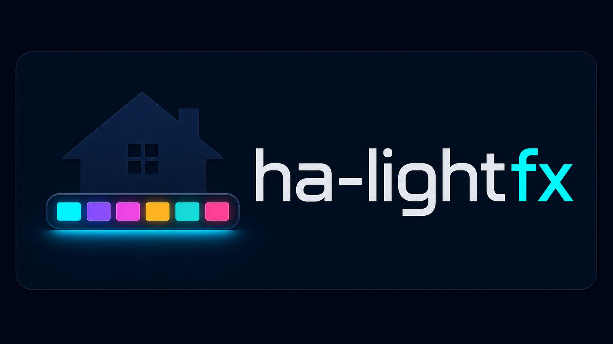
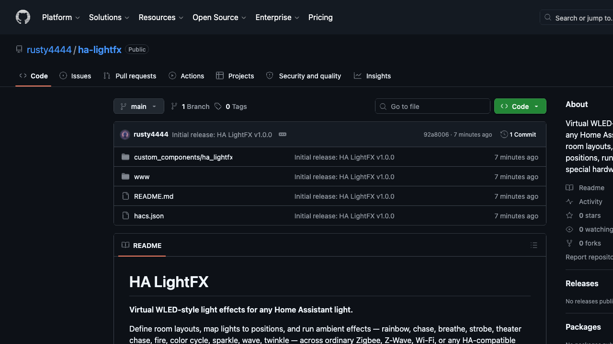

# HA LightFX

<p align="center">
  <a href="https://buymeacoffee.com/rusty4" target="_blank">
    
  </a>
</p>

<p align="center">
  
</p>

**Version 1.1.0** — virtual WLED-style light effects for ordinary Home Assistant lights.

HA LightFX lets you build virtual room layouts, place Home Assistant `light` entities on a 0-100 grid, and run animated effects across them. It works with Zigbee, Z-Wave, Wi-Fi, Matter, Hue, ESPHome, or any other light that Home Assistant can control. No LED strip controller or WLED hardware is required.



## What You Get

- A Home Assistant custom integration with persistent layout storage.
- A visual config-flow editor for layouts, lights, profiles, and layout groups.
- A bundled Lovelace custom card served by the integration at `/ha_lightfx/ha-lightfx-card.js`.
- 16 Home Assistant services for automation, previewing, layout management, profiles, groups, and sequences.
- 10 built-in effects: `rainbow`, `chase`, `breathe`, `strobe`, `theater_chase`, `fire`, `color_cycle`, `sparkle`, `wave`, `twinkle`.
- Zone-aware effects, direction control, brightness/speed/transition controls, and optional audio-reactive brightness modulation.

## Supported Effects

| Effect | Description | Main Controls |
|--------|-------------|---------------|
| `rainbow` | Smooth hue sweep across lights based on virtual position. | brightness, speed, direction |
| `chase` | A single active light moves through the layout. | color, brightness, speed, direction |
| `breathe` | Slow fade in/out using the primary color. | color, brightness, speed |
| `strobe` | Alternating flash/on-off pulses. | color, brightness, speed |
| `theater_chase` | Alternating primary/secondary color chase. | color, color2, brightness, speed, direction |
| `fire` | Warm randomized flicker based on the primary color. | color, brightness, speed |
| `color_cycle` | Global hue transition across all mapped lights. | brightness, speed |
| `sparkle` | Random sparkle/twinkle flashes. | brightness, speed |
| `wave` | HSV wave across the virtual x/y layout. | brightness, speed, direction |
| `twinkle` | Random twinkling between two colors. | color, color2, brightness, speed |

## Concepts

### Layouts

A layout is a named virtual space, such as `Living Room`, `Bedroom`, or `Downstairs`. Layout IDs are generated from the name by lowercasing and replacing spaces with underscores. For example:

| Name | Layout ID |
|------|-----------|
| `Living Room` | `living_room` |
| `Kitchen` | `kitchen` |
| `Downstairs Hall` | `downstairs_hall` |

### Light Positions

Each light has:

- `entity_id` — the Home Assistant light entity, for example `light.living_room_lamp`.
- `x` — horizontal position, 0-100.
- `y` — vertical position, 0-100.
- `z` — optional depth, 0-100. Current effects preserve and expose it; future effects can use it for 3D-style spatial animation.
- `zone` — one of `ceiling`, `wall`, `accent`, `floor`, `other`.

### Zones

Zones let you run different effects on different areas in one layout. Example: ceiling lights can run `chase` while wall lights run `breathe`.

### Profiles

Profiles are named effect presets. They store an effect config so you can reuse it from automations or the visual editor.

### Layout Groups

Layout groups let you run the same effect across several layouts at once, such as `downstairs` containing `living_room`, `kitchen`, and `hallway`.

### Previous State Restore

When an effect starts, HA LightFX stores the previous state of every mapped light. `ha_lightfx.stop_effect` can restore those previous states with `restore_previous: true`.

## Installation

### HACS Installation (Recommended)

1. Open **HACS → Integrations → ⋮ → Custom repositories**.
2. Add this repository URL:
   ```text
   https://github.com/rusty4444/ha-lightfx
   ```
3. Select category **Integration**.
4. Click **Add**.
5. Find **HA LightFX** in HACS and click **Download**.
6. Restart Home Assistant.
7. Go to **Settings → Devices & Services → Add Integration** and search for **HA LightFX**.

### Manual Installation

1. Download or clone this repository.
2. Copy the integration folder:
   ```text
   custom_components/ha_lightfx/
   ```
   into your Home Assistant config folder:
   ```text
   /config/custom_components/ha_lightfx/
   ```
3. Restart Home Assistant.
4. Go to **Settings → Devices & Services → Add Integration** and search for **HA LightFX**.

### Dashboard Resource

The Lovelace card is bundled inside the integration and served at:

```text
/ha_lightfx/ha-lightfx-card.js
```

The Lovelace card is auto-registered as a dashboard resource when the integration starts. A hard browser refresh (Ctrl+Shift+R / Cmd+Shift+R) may be needed to pick up the card on first install.

If the card does not appear, verify the resource exists under **Settings → Dashboards → Resources**:

```text
/ha_lightfx/ha-lightfx-card.js
```

with type **JavaScript Module**. Add it manually if needed.

## Quick Start

1. Install the integration and restart Home Assistant.
2. Add the integration from **Settings → Devices & Services → Add Integration → HA LightFX**.
3. Open the integration entry and click **Configure**.
4. Choose **Manage Layouts → Create Layout** and create a layout, for example `Living Room`.
5. Choose **Manage Lights → Add Light**.
6. Pick a Home Assistant light entity.
7. Set its `x`, `y`, optional `z`, and `zone`.
8. Repeat for each light in the room.
9. Add the dashboard card:
   ```yaml
   type: custom:ha-lightfx-card
   ```
10. Select the layout, choose an effect, and press **Play**.

## Lovelace Card

The built-in card type is:

```yaml
type: custom:ha-lightfx-card
```

The card auto-discovers layouts through the integration WebSocket API. No card-level YAML options are required for basic use.

The card provides:

- Lovelace visual card editor via the dashboard UI.
- Layout selector buttons.
- Optional default layout selection.
- 2D layout visualization.
- Zone-colored light dots.
- Optional drag-and-drop light repositioning.
- Effect selector.
- Primary and secondary color pickers.
- Brightness and speed sliders.
- Optional refresh button.
- Play/Stop controls.

### Lovelace Visual Editor Options

Open the dashboard editor, add **Custom: HA LightFX**, then configure the card from the visual editor. YAML editing is optional.

| Option | Type | Default | Description |
|--------|------|---------|-------------|
| `title` | string | `HA LightFX` | Card header title. |
| `default_layout` | string | empty | Layout ID to auto-select, for example `living_room`. Leave empty to select the first available layout. |
| `show_layout_selector` | boolean | `true` | Show buttons for switching layouts. Disable this for a single-layout dashboard card. |
| `show_zone_legend` | boolean | `true` | Show the zone color legend under the grid. |
| `allow_drag` | boolean | `true` | Allow dragging light dots to update x/y positions. |
| `show_refresh_button` | boolean | `true` | Show the header refresh button for reloading layouts. |
| `confirm_stop` | boolean | `true` | Ask for confirmation before stopping and restoring lights. |

Example YAML equivalent:

```yaml
type: custom:ha-lightfx-card
title: Living Room FX
default_layout: living_room
show_layout_selector: false
show_zone_legend: true
allow_drag: true
show_refresh_button: true
confirm_stop: true
```

## Visual Editor

Open **Settings → Devices & Services → HA LightFX → Configure**.

Available menus:

- **Manage Layouts** — create and delete layouts.
- **Manage Lights** — add, update, and remove mapped lights.
- **Manage Profiles** — create and delete effect profiles.
- **Manage Groups** — create and delete layout groups.

The visual editor is the recommended setup path. Services are available for automation and advanced users.

## Services Reference

All services use the domain `ha_lightfx`.

| Service | Required Fields | Optional Fields | Response Support | Description |
|---------|-----------------|-----------------|------------------|-------------|
| `create_layout` | `name` | `icon` | Optional | Create a layout. With `return_response: true`, returns the generated `layout_id`. |
| `remove_layout` | `layout_id` | — | No | Delete a layout. |
| `list_layouts` | — | — | Required | Return all layouts, light counts, and status. |
| `add_light` | `layout_id`, `entity_id`, `x`, `y` | `z`, `zone` | No | Add or update a light's layout position. |
| `remove_light` | `layout_id`, `entity_id` | — | No | Remove a light from a layout. |
| `start_effect` | `layout_id` | `effect`, `color`, `color2`, `brightness`, `speed`, `transition`, `direction`, `audio_entity_id`, `effect_per_zone` | No | Start an effect loop. |
| `stop_effect` | `layout_id` | `restore_previous` | No | Stop an effect and optionally restore previous light states. |
| `preview_effect` | `layout_id` | `effect`, `params` | Optional | Compute one preview frame without starting an effect. |
| `create_profile` | `name` | `config` | No | Save an effect profile. |
| `delete_profile` | `profile_id` | — | No | Delete a profile. |
| `list_profiles` | — | — | Required | Return all saved profiles. |
| `create_group` | `group_id`, `layout_ids` | — | No | Create or replace a layout group. |
| `delete_group` | `group_id` | — | No | Delete a layout group. |
| `list_groups` | — | — | Required | Return all layout groups. |
| `start_sequence` | `layout_id`, `sequence` | `effect`, `brightness` | No | Run timed effect steps on one layout. |
| `start_layout_group` | `group_id` | `effect`, `color`, `color2`, `brightness`, `speed`, `transition`, `direction` | No | Start the same effect across a layout group. |

### Common Field Values

| Field | Accepted Values |
|-------|-----------------|
| `effect` | `rainbow`, `chase`, `breathe`, `strobe`, `theater_chase`, `fire`, `color_cycle`, `sparkle`, `wave`, `twinkle` |
| `color`, `color2` | RGB list such as `[255, 0, 0]` or a hex string where supported by service calls. |
| `brightness` | Integer 0-100. |
| `speed` | Integer 1-100. |
| `transition` | Seconds, 0.1-5.0. |
| `direction` | `forward`, `reverse`, `bounce`. |
| `zone` | `ceiling`, `wall`, `accent`, `floor`, `other`. |

## Service Examples

### Create a Layout and Get the ID

```yaml
service: ha_lightfx.create_layout
return_response: true
data:
  name: "Living Room"
  icon: mdi:sofa
```

Response:

```yaml
layout_id: living_room
```

### Add Lights to a Layout

```yaml
service: ha_lightfx.add_light
data:
  layout_id: living_room
  entity_id: light.living_room_ceiling
  x: 50
  y: 20
  z: 10
  zone: ceiling
```

```yaml
service: ha_lightfx.add_light
data:
  layout_id: living_room
  entity_id: light.floor_lamp
  x: 20
  y: 80
  z: 0
  zone: accent
```

### Start a Basic Effect

```yaml
service: ha_lightfx.start_effect
data:
  layout_id: living_room
  effect: rainbow
  brightness: 60
  speed: 40
  transition: 0.5
  direction: forward
```

### Start a Two-Color Effect

```yaml
service: ha_lightfx.start_effect
data:
  layout_id: living_room
  effect: theater_chase
  color: [255, 0, 0]
  color2: [0, 0, 255]
  brightness: 70
  speed: 50
```

### Stop and Restore Previous Light States

```yaml
service: ha_lightfx.stop_effect
data:
  layout_id: living_room
  restore_previous: true
```

### Preview One Frame

```yaml
service: ha_lightfx.preview_effect
return_response: true
data:
  layout_id: living_room
  effect: fire
  params:
    color: [255, 100, 0]
    brightness: 70
    speed: 40
```

### Zone-Aware Effects

```yaml
service: ha_lightfx.start_effect
data:
  layout_id: living_room
  brightness: 60
  speed: 45
  effect_per_zone:
    ceiling: chase
    wall: breathe
    accent: sparkle
    floor: wave
```

### Audio-Reactive Effect

`audio_entity_id` can point at a `media_player`. HA LightFX uses the player's `volume_level` attribute to modulate effect brightness.

```yaml
service: ha_lightfx.start_effect
data:
  layout_id: living_room
  effect: fire
  color: [255, 100, 0]
  brightness: 70
  audio_entity_id: media_player.living_room
```

### Create a Profile

```yaml
service: ha_lightfx.create_profile
data:
  name: "Warm Fire"
  config:
    effect: fire
    color: [255, 120, 20]
    brightness: 55
    speed: 35
```

### Create a Layout Group

```yaml
service: ha_lightfx.create_group
data:
  group_id: downstairs
  layout_ids:
    - living_room
    - kitchen
    - hallway
```

### Start an Effect Across a Group

```yaml
service: ha_lightfx.start_layout_group
data:
  group_id: downstairs
  effect: rainbow
  brightness: 50
  speed: 40
```

### Run a Sequence

```yaml
service: ha_lightfx.start_sequence
data:
  layout_id: living_room
  brightness: 80
  sequence:
    - effect: rainbow
      duration_seconds: 30
    - effect: chase
      duration_seconds: 15
      speed: 60
    - effect: strobe
      duration_seconds: 10
      brightness: 100
```

## Automation Examples

### Motion-Triggered Rainbow After Sunset

```yaml
alias: "Rainbow on Arrival"
trigger:
  - platform: state
    entity_id: binary_sensor.motion_living_room
    to: "on"
condition:
  - condition: sun
    after: sunset
action:
  - service: ha_lightfx.start_effect
    data:
      layout_id: living_room
      effect: rainbow
      brightness: 40
      speed: 30
  - delay:
      minutes: 5
  - service: ha_lightfx.stop_effect
    data:
      layout_id: living_room
      restore_previous: true
```

### Bedtime Breathe

```yaml
alias: "Bedtime Breathe"
trigger:
  - platform: time
    at: "22:00:00"
action:
  - service: ha_lightfx.start_effect
    data:
      layout_id: bedroom
      effect: breathe
      color: [255, 50, 50]
      brightness: 20
      speed: 20
```

### Doorbell Party Sequence

```yaml
alias: "Doorbell Party Sequence"
trigger:
  - platform: state
    entity_id: binary_sensor.doorbell
    to: "on"
action:
  - service: ha_lightfx.start_sequence
    data:
      layout_id: living_room
      brightness: 80
      sequence:
        - effect: rainbow
          duration_seconds: 30
        - effect: chase
          duration_seconds: 15
          speed: 60
        - effect: strobe
          duration_seconds: 10
          brightness: 100
```

## Troubleshooting

### The card is not available in the dashboard card picker

- Confirm the integration is installed and Home Assistant has been restarted.
- Confirm the dashboard resource exists:
  ```text
  /ha_lightfx/ha-lightfx-card.js
  ```
- Resource type must be **JavaScript Module**.
- Hard refresh the browser: Ctrl+Shift+R / Cmd+Shift+R.
- Check browser dev tools for failed requests to `/ha_lightfx/ha-lightfx-card.js`.

### A layout has no lights

- Open **Configure → Manage Lights** and add at least one light.
- Or call `ha_lightfx.add_light` with the correct `layout_id` and `entity_id`.
- Use `ha_lightfx.list_layouts` with `return_response: true` to inspect current layout state.

### Effects start but lights do not visibly change

- Confirm the mapped entities are real `light` entities and are available in Home Assistant.
- Some lights may not support RGB color; try effects that rely mostly on brightness or use supported color modes.
- Try lower `transition` and higher `brightness`.
- Check Home Assistant logs for `ha_lightfx` warnings.

### Effects stop but lights do not restore

- Use:
  ```yaml
  service: ha_lightfx.stop_effect
  data:
    layout_id: living_room
    restore_previous: true
  ```
- Restore only applies to lights that were part of the layout when the effect started.

### A grouped layout was deleted

`start_layout_group` skips stale/missing layout IDs and logs a warning. Recreate the missing layout or update the group with `create_group` using the current list of layout IDs.

## Storage and Data

HA LightFX stores layouts, lights, profiles, and groups in Home Assistant storage under the integration's storage key. Data persists across Home Assistant restarts.

Stored data includes:

- Layout names and icons.
- Light entity IDs and x/y/z/zone positions.
- Effect profiles.
- Layout groups.

## Development

Repository structure:

```text
custom_components/ha_lightfx/
├── __init__.py             # Integration setup, service registration, WebSocket API, frontend serving
├── config_flow.py          # Initial setup and visual configuration editor
├── const.py                # Constants, service names, effects, storage version
├── lightfx_engine.py       # Effect engine and persistence model
├── manifest.json           # Home Assistant manifest
├── services.yaml           # Service definitions shown in Developer Tools
├── strings.json            # Config-flow UI strings
├── translations/
│   └── en.json             # English translations
├── brand/
│   ├── icon.png
│   ├── icon@2x.png
│   ├── logo.png
│   └── logo@2x.png
└── www/
    └── ha-lightfx-card.js  # Bundled, browser-loadable Lovelace custom card

frontend/
└── ha-lightfx-card.js      # Source for the card/editor before bundling
```

The committed `custom_components/ha_lightfx/www/ha-lightfx-card.js` file is the browser-loadable bundle used by Home Assistant. Edit `frontend/ha-lightfx-card.js`, then rebuild the bundle:

```bash
npm install
npm run build:card
```

Useful validation commands:

```bash
python3 -m py_compile custom_components/ha_lightfx/*.py
python3 -m json.tool custom_components/ha_lightfx/manifest.json >/dev/null
python3 -m json.tool hacs.json >/dev/null
python3 -m json.tool custom_components/ha_lightfx/strings.json >/dev/null
python3 -m json.tool custom_components/ha_lightfx/translations/en.json >/dev/null
ruby -e 'require "yaml"; YAML.load_file("custom_components/ha_lightfx/services.yaml")'
node --check frontend/ha-lightfx-card.js
node --check custom_components/ha_lightfx/www/ha-lightfx-card.js
```

## Release Notes: 1.0.7

Version 1.0.7 improves the add-light form:

- Entity selection is now a dropdown picker filtered to `light` domain, instead of a bare text field.

## Release Notes: 1.0.6

Version 1.0.6 fixes an entity serialization bug in the config flow:

- Switches `cv.entity_id` to `cv.string` in the add-light schema so `voluptuous_serialize` can render the form field in the HA frontend.

## Release Notes: 1.0.5

Version 1.0.5 fixes config flow errors and auto-registers the Lovelace card:

- Auto-registers the Lovelace dashboard card resource on integration setup — no manual resource URL entry needed.
- Fixes "extra keys not allowed @ _action" when adding or editing lights in the config flow editor.

## Release Notes: 1.0.4

Version 1.0.4 fixes two bugs found during live install testing:

- Fixed `Store` import in `__init__.py` — `hass.helpers.storage.Store()` is not valid in modern HA. Uses `Store(hass, ...)` import pattern.
- Fixed `OptionsFlow.__init__` config entry property collision — `config_entry` is a read-only base-class property.

## Release Notes: 1.0.3

Version 1.0.3 adds and hardens the Lovelace visual card editor:

- Adds a dashboard visual editor via `getConfigElement()` and `ha-form`.
- Bundles the Lit-based card source for browser loading through Home Assistant.
- Adds configurable card options for title, layout selector, zone legend, dragging, refresh button, and stop confirmation.
- Refreshes card layout state after mutating service calls.
- Keeps dragged light dot, label, and glow positions aligned.
- Requests card updates when Home Assistant state changes.
- Adds explicit HACS integration category metadata.
- Cleans up unused options-flow abort copy.

Version 1.0.2 included the sequential multi-model review fix set:

- Bundled frontend card served from the integration path.
- Required brand assets for Home Assistant/HACS.
- README, manifest, and HACS metadata alignment.
- Safer options-flow context handling.
- Service cleanup on unload.
- Stale layout handling in layout groups.
- Profile/layout name validation improvements.
- RGB color list length validation.
- Storage version alignment.
- Optional `create_layout` response with generated `layout_id`.
- Preview failure warning logging.

## AI Used in Development

This project used AI-assisted development for code review, bug fixing, documentation, and release tasks. Multi-model sequential reviews were run across the codebase to catch issues before release. All AI-generated changes were reviewed by a human before merging.

## License

MIT

